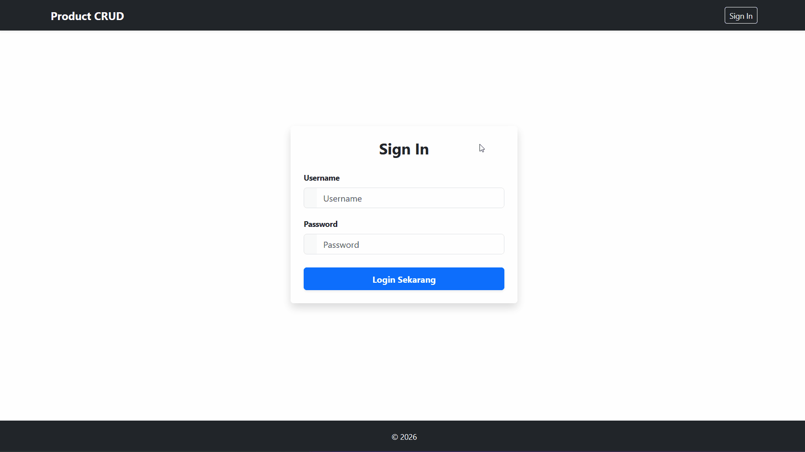
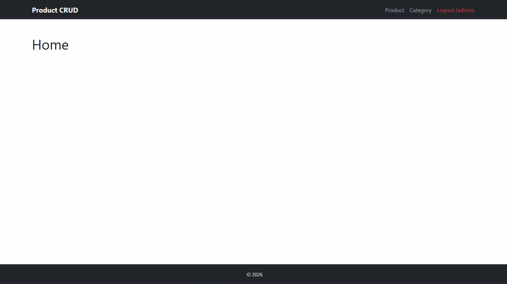
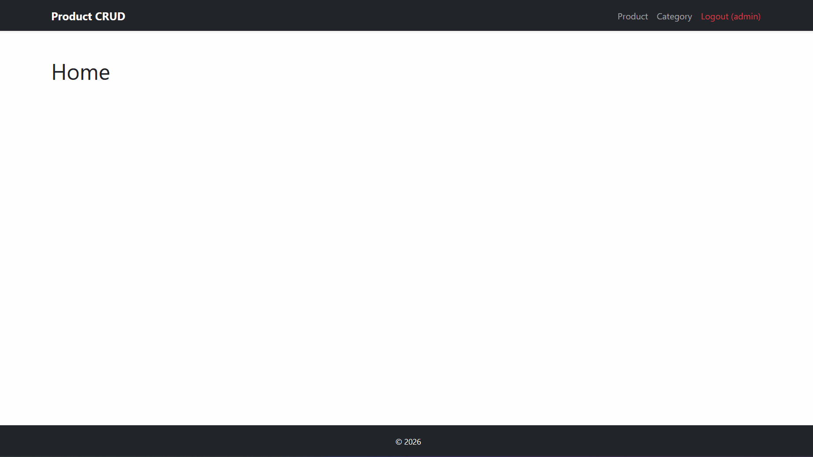
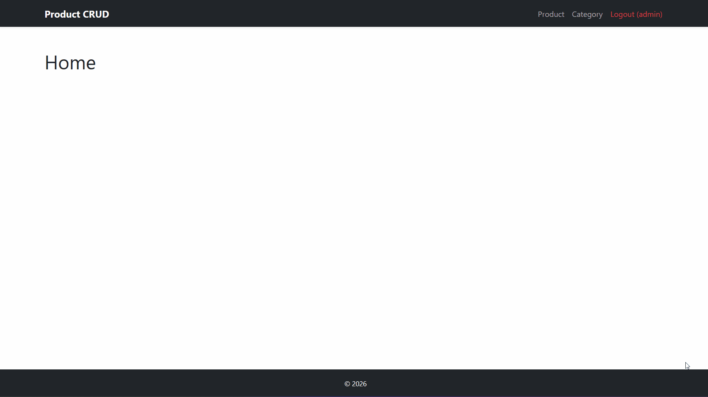
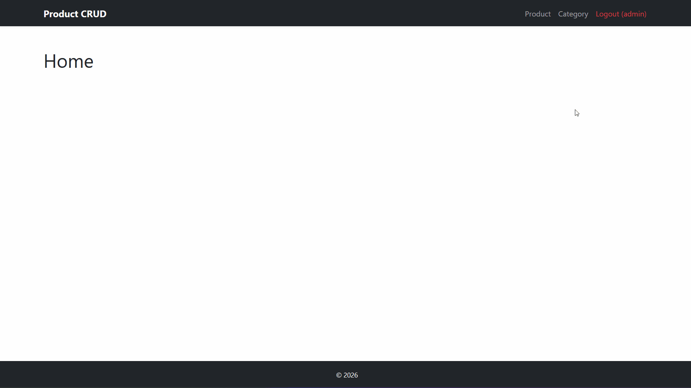
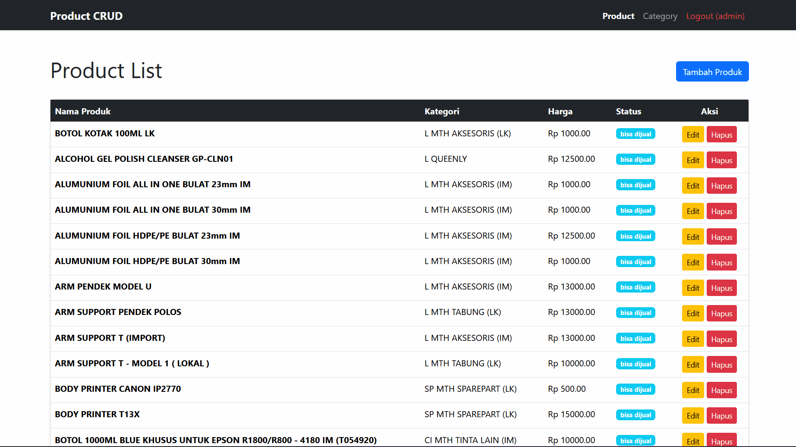

# Product Crud

Ini adalah panduan penggunaan aplikasi **Product CRUD**. Aplikasi ini memungkinkan Anda untuk mengelola data produk dan kategori dengan mudah.

---

## 🔐 Login

Sebelum mengelola data, Anda harus masuk ke sistem terlebih dahulu.

* **Username**: `admin`
* **Password**: `admin`

---

## 📦 Menu Produk

Kelola semua data barang dagangan Anda di sini.

### 1. Melihat Daftar Produk

Tekan tombol **Product** pada navbar untuk melihat seluruh daftar produk yang tersedia.

### 2. Menambahkan Produk

Tekan tombol **Tambah Produk**, isi semua field yang diperlukan, lalu simpan.

### 3. Mengubah Produk

Klik tombol **Edit** pada salah satu baris produk, perbarui datanya, lalu tekan tombol **Simpan**.

### 4. Menghapus Produk

Klik tombol **Delete**, konfirmasi pada pop-up yang muncul dengan menekan tombol **Ya, Hapus Produk**.

---

## 📂 Menu Kategori

Gunakan menu ini untuk mengelompokkan produk Anda.

### 1. Melihat Daftar Kategori

Akses melalui tombol **Kategori** di navbar.

### 2. Menambahkan Kategori

Klik **Tambah Kategori**, masukkan nama kategori baru, lalu simpan.

### 3. Mengubah Kategori

Klik tombol **Edit**, ubah nama kategori, dan simpan perubahan.

### 4. Menghapus Kategori

Klik **Delete**, lalu konfirmasi dengan menekan tombol **Ya, Hapus Kategori**.

> [!CAUTION]
> **PENTING (Note):** Menghapus sebuah kategori akan menyebabkan **semua produk** yang terhubung dengan kategori tersebut ikut terhapus secara otomatis (*Cascade Delete*). Pastikan Anda telah memindahkan produk ke kategori lain sebelum menghapus kategori utama.

---

## 🚪 Logout

Untuk keluar dari sistem secara aman, klik tombol **Logout** pada navbar.

---

> [!NOTE]
> **Nama Produk dan Nama Kategori Harus Unik:** Sistem tidak akan menerima dua produk dengan nama yang sama persis.

